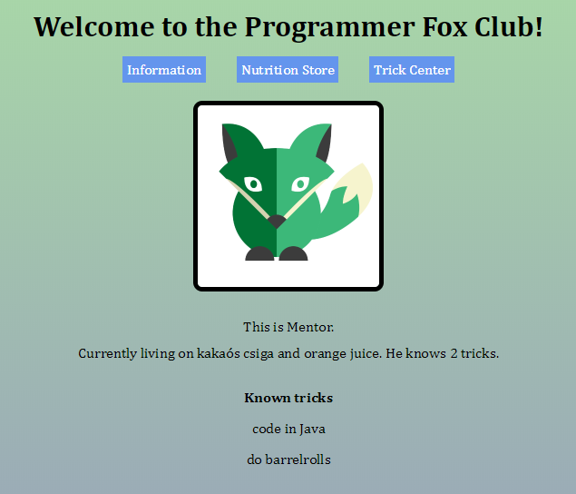

# Programmer Fox Club

A 'tamagochi'-like web application, where a user can create then take care of his or her virtual fox.

This small application has also been deployed to heroku.
[Try it out here!](https://michaelbarcley-foxclub.herokuapp.com/)

## Preview

