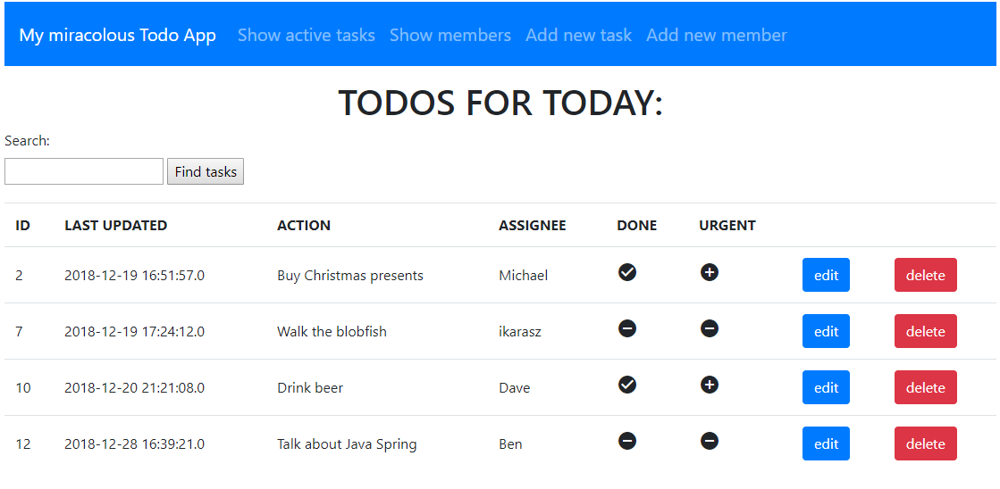
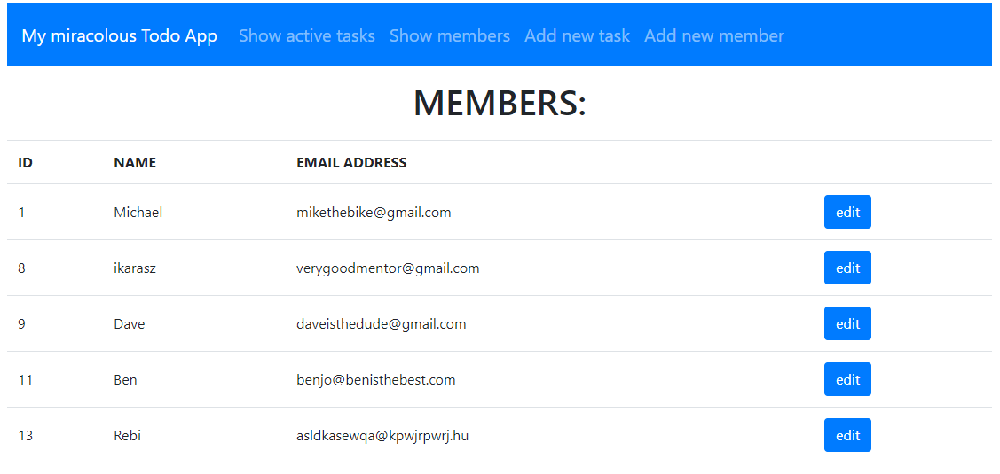
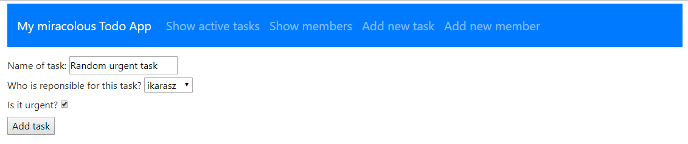
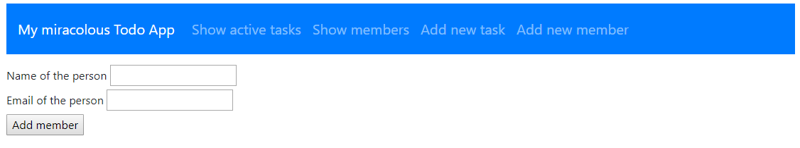

# Spring ToDo App (with bootstrap)

A ToDo web application with users created with Java Spring during the begining of week 9.

## Features

- Create, modify and delete todos
- Create, modify users
- Todos are attached to assignees (users)
- Functional search field
- Listing only active tasks
- Bootstrap design

## Preview

Main page

Members page

Add new task

Add new user

